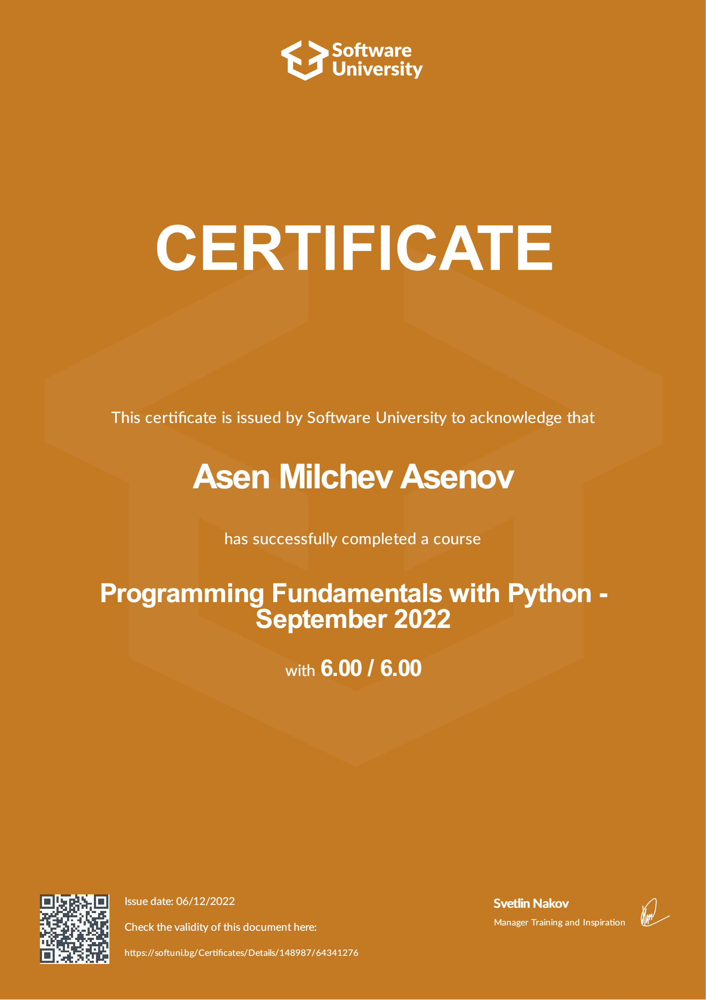

# SoftUni Programming Fundamentals with Python September 2022

## This repository contains my solutions for the tasks from the SoftUni course Programming Fundamentals with Python-September 2022. 
## [Training program](https://softuni.bg/trainings/3840/programming-fundamentals-with-python-september-2022)
## [Certificate credentials](https://softuni.bg/certificates/details/148987/64341276)

&nbsp;

&nbsp;

### Course details
Course duration: 12 weeks 
Course start: 12.09.2022 
Course tutors:  
 • Common Lectures: Desislava Topuzakova 
 • Python Labs: Mario Zahariev 
 • Python Exercises: Ivan Shopov 

### Course curriculum:
1. Resources 
2. IT Talks 
3. Language Comparison 
4. Course Introduction 
5. Basic Syntax, Conditional Statements and Loops 
  • Basic Syntax and First Steps; 
  • Conditional Statements (if, elif, else, indentation, and, or); 
  • Loops. 
6. Exercise: Basic Syntax, Conditional Statements and Loops 
7. Git and GitHub 
  • Software Configuration Management; 
  • Introduction to Git; 
  • Introduction to GitHub. 
8. Data Types and Variables 
  • What is Data Type?; 
  • Strings; 
  • Int, Float; 
  • Booleans; 
  • Additional Data Types. 
9. Exercise: Data Types and Variables 
10. HTTP Basics 
  • HTTP Developer Tools; 
  • HTML Forms, Request, Response; 
  • URLs and ERL Structure. 
11. Lists Basics 
  • List Definition and Usage; 
  • Storing Data; 
  • Creating Lists; 
  • Accessing Elements; 
  • List Manipulations; 
  • Looping Through Lists; 
  • Searching in Lists. 
12. Exercise: Lists Basics 
13. HTML & CSS Basics 
  • Intro to HTML; 
  • HTML Common Elements; 
  • Introduction to CSS; 
  • Selectors; 
  • Block Elements; 
  • Dev Tools; 
  • Fonts. 
14. Functions 
  • Functions Overview; 
  • Declaring and Invoking Functions; 
  • Return Values; 
  • Lambda Functions; 
  • Parameters vs Arguments. 
15. Exercise: Functions 
16. Software Development Concepts - Part 1 
  • The 4 Skills of Sotware Engineers; 
  • Fundamental Software Engineering Concepts; 
  • Software Architectures, Front-End and Back-End. 
17. Lists Advanced 
  • List Comprehension; 
  • List Methods; 
  • Advanced Methods; 
  • Advanced List Manipulations; 
  • The set() Method. 
18. Exercise: Lists Advanced 
19. Exam Preparation 
20. Regular Mid Exam 
21. Objects and Classes 
  • Object-Oriented Programming (OOP); 
  • Classes; 
  • Objects; 
  • Class Attributes and Instance Methods. 
22. Exercise: Objects and Classes 
23. Software Development Concepts - Part 2 
  • Front-End Development Concepts; 
  • Back-End Development Concepts; 
  • Embedded Systems and IoT; 
  • Software Engineering Concepts. 
24. Dictionaries 
  • Dictionary Definition; 
  • Keys and Values; 
  • Iterating Through Dictionaries; 
  • Existence in Dictionaries; 
  • Dictionary Methods. 
25. Exercise: Dictionaries 
26. Bitwise Operations 
  • What is a Bit, Byte, KB, MB?; 
  • Numerals Systems; 
  • Representation of Data in Computer Memory. 
27. Text Processing 
  • String Definition; 
  • String Manipulation; 
  • String Methods. 
28. Exercise: Text Processing 
29. Problem Solving 
  • Fundamental Skills of Software Engineers; 
  • Problems: Definition and Problem Solving; 
  • Stages of Problem Solving; 
  • Solving Exam Problems. 
30. Regular Expressions 
  • Definition; 
  • Syntax; 
  • RegEx in Python; 
  • RegEx Methods. 
31. Exercise: Regular Expressions 
32. Database Basics 
  • Databases Introduction; 
  • SQL vs. NoSQL Databases; 
  • DBMS Systems; 
  • Relational Databases, SQL and MySQL Database; 
  • NoSQL Databases and MongoDB. 
33. Exam Preparation 
34. Exam Preparation 
35. QA Introduction 
  • Software Quality Assurance; 
  • QA Engineers and Resposibilities; 
  • Bugs and Bug Trackers; 
  • Testing, Test Types and Test Levels; 
  • Test Automation, Frameworks and Tools. 
36. Basic Web Project 
  • Django; 
  • Django REST; 
  • CRUD demo. 
37. Regular Final Exam 
38. Retake Mid Exam 
39. Retake Final Exam 
